# FileChange_Mod_Manager
A Java program for managing Mods that require manual integration with the game files instead of in a dedicated Mod directory but works for both cases.

#### A personal side note:
The goal is to create a practical project for both real-world usage but also as practice and a showcase of my Java "know-how". This is why I opted to not use a virtual file system (VFS) (how platforms such as Vortex from Nexus works) as I wanted the added challenge of manual file integrity management, whereas with a VFS there would be no need to worry about file conflicts or even moving files.

# Features (Current and planned)
### General: 
- Safe by design. Operations all take place within a temporary directory. Only when all operations have been successful are final moves made and temp/ cleaned. This is also to ensure working files are not externally altered during operation. Should an error occur at any stage no modifications will have taken place on the game files, even in delete operations.
- Thorough error checking and comprehensive logging.
  - Detects missing files when attempting to deploy Mods and will halt.
  - Verify files Hashes match to detect changes and avoid unnecessary file system operations.
- In case of final write failures, data stored in temp is recoverable (temp/ cleaning only takes place when no errors occur)
- Visual feedback (Console) Actions are carefully logged (logfile is optional), allowing exact failure pinpointing.

### Mods: 
- Track, add, remove and update Mods deployed into a game.
- Mods can be deployed individually to a game while automatically backing up game files and tracking mod-overrides.
- Mods can be re-deployed individually with different load orders, fully handling new load priority **without** re-building from scratch.
- Individual mods can be removed (safely trashed) from the game restoring original files if needed.
- Keep meta data for each mod:
  - Display name.
  - Description.
  - Version number.
  - Download information. Store a download URL and tag the download source (eg: Nexus, ModDB, Steam, custom...)
  - Add tags to mods for GUI sorting and filtering. (TODO)

### Games: 
- Stores a current GameState with the game, all data needed to track and remove deployed Mods is stored within the game directory.
- Track multiple Games.
- Flexible Mod management, deployment directory and Mod file storage are customisation per a game. This provides support for games with unique mod file locations.
- Store non-installed mods in a dedicated directory. Stored mods are ready to be deployed or can be packed. (TODO: archive file contents but leave manifest for ease of access)

### GameStates:
- Keep snapshots of deployed mod lists.
- Design, record and deploy GameStates. Allows making major changes quickly, automating the re-building process.

---

# Interfaces

### GUI (Planned)
- Tile view of games with icons and basic info. Game icon could double as a background image, or have a separate background for each game. Just a "nice to have" feature.
- Download link for mods will be a clickable link. (might be nice)
- Interactive way to reorder mods by dragging mod tiles.
- Enable/disable mods by dragging them to and from the deployed/stored containers. (Need to see how feasible that is)
- Plan to use drag and drop areas for compiling new/updated mods. (Never need to open a file-manager yourself)
- Write changes to a temp GameState or pick from saved profiles. Then Apply the GameState when ready. (TODO)

### CLI Usage:
```bash
game_manager: > help

Program Commands:
info            | Show general info about the program and config
-h , help       | Show this help
exit / quit     | Exit the program

Game Manager Commands:
-L , list       | List all game profiles
-A , add        | Add a new game profile
-R , remove     | Remove a game profile
  --id <target> | target game id
     [--atomic] | removed files will not be left in trash
-U , update     | Update a game profile
  --id <target> | target game id
-M , mod        | Enter mod manager for a game
  --id <target> | target game id

Mod Manager Commands:
-L , list       | List all installed Mods
          [--a] | All avaialbe Mods in storage
          [--u] | Only uninstalled Mods in storage
-D , deploy     | Deploy a mod to game files
-R , remove     | Remove a mod from game files
  --id <target> | target mod id
          --all | removes all mod from game files
     [--atomic] | removed files will not be left in trash
-o , order      | reorder a mod
  --id <target> | target mod id
   --n <number> | new load order
-c , compile    | Compile a new mod
   --dir <name> | name-only of the directory withing temp
delete          | Delete a mod from storage, cannot be installed
  --id <target> | target mod id
     [--atomic] | removed files will not be left in trash
-G , game       | Return to game manager
```

---

# Behind the scenes...

In the docs for this project, I have created diagrams to fully explain the logical steps taken for various key methods and archutecture designs.

Uses no build tools to be as ultra-lightweight and self-contained as possible. External libary: JSON.simple V1.1.1.jar `https://github.com/fangyidong/json-simple`
Main mod functions are run by a ModManager class, meant to capable of recieving console and GUI commands and input.

Mods are split into two types: Regular Mods (parent) have less fields to be more lightweight for easier storage and more efficent usage when the GUI needs to fetch Mod data to display but still needs the Mod_Id for functioning.
ModManifests are a child Mod that has the additional functionality of tracking Files, which themselves are stored as ModFile instances, storing integrity data.

### File integrity and order of operations:

Operations need to track file overrides, backups, mod-ownership, and load order.
- A `Mod Manifest` which tracks what files and hashes of those file a Mod has.
- Next, a `File Lineage` for each file deployed in the game is kept. This is a Stack of file-owners and the hashes each owner expects. (Stack is order with "highest load priority" / "current owner" on top)

With these, when a new mod is deployed and a file already exists we can determine who owns the file and how to respond with these questions:
1. Does the file have a Lineage?
- Y. Then another mod owns it.
- N. Then we are the first mod to try override it, therefore it must be a game-file. Back it up and list the GAME as the first owner.

2. What is the load order of the current owner against the current mod being operated on?
- If current is lower: It has not got priority and must insert itself into the stack after all higher priority entries. This now **Wants to own** the file.
- If current is higher: It has priority and can override the file and push itself as the new top owner on the stack. This now **Owns** the file.

# Program structure

This is a diagram of the directory structure used by the program for its own working directory and storing game-deployment data within the game files.

```mermaid
graph TD
    ProgramData[Program Data]
    ModStorage[Mod Storage]
    GameDir[Game Directory]

    
    subgraph ProgramData
        PD[~/.modmanager/] --> Config(config.json)
        PD --> GamesDir[games/]
        
        GamesDir --> GameList(game_list.json)
        GamesDir --> GameConfig(Game_id.json)
        GamesDir --> IconsDir[icons/]
        IconsDir --> Icon(Game_id.png)

        PD --> TempDir[.temp/]
        TempDir[.temp/] --> CompileDir(CompileMe/)
        TempDir[.temp/] --> TempTrashDir[trash/] --> TrashMod(other-unused-51449__20251226_102656/)

        PD --> LogDir[logs/]
    end

    subgraph ModStorage
        MS[./ModStorage/] --> GameMods[Game_id/]
        
        GameMods --> ModA[other-tstmod-10808/]
        
        ModA --> MAhome[.mod_manager]
        MAhome --> MAmanifest[manifests/] --> MAman(other-tstmod-10808.json)

        ModA --> MAf1(example_file_1.txt)
        ModA --> MAd1[data/] --> MAf2(example_file_2.txt)
    end

    subgraph GameDir
        GR[./GameRoot/] --> GameFiles[Vanilla game files]
        GR --> ModManagerDir[.modmanager/]
        
        ModManagerDir --> ManifestDir[manifests/] --> MMD_Man(mod_id.json)
        ModManagerDir --> LineageDir[lineages/] --> MMD_lineage(file.txt.json)
        ModManagerDir --> BackupsDir[backups/] --> MMD_back(file.txt.backup)
        ModManagerDir --> GameState(game_state.json)
    end    

    %% Styles
        style PD color:#FFFFFF, fill:#265250, stroke:#0acdc4
            style ProgramData stroke:#0acdc4
        style MS color:#FFFFFF, fill:#693e21, stroke:#cd580a
            style ModStorage stroke:#cd580a
        style GR color:#FFFFFF, fill:#36632c, stroke:#2ccd0a
            style GameDir stroke:#2ccd0a

        %% Example data
            style GameConfig color:#FFFFFF, fill:#000f3f, stroke:#1b368d
            style Icon color:#FFFFFF, fill:#000f3f, stroke:#1b368d
            style CompileDir color:#FFFFFF, fill:#000f3f, stroke:#1b368d
            style TrashMod color:#FFFFFF, fill:#000f3f, stroke:#1b368d
            
            style ModA color:#FFFFFF, fill:#000f3f, stroke:#1b368d
            style MAman color:#FFFFFF, fill:#000f3f, stroke:#1b368d
            style MAf1 color:#FFFFFF, fill:#000f3f, stroke:#1b368d
            style MAd1 color:#FFFFFF, fill:#000f3f, stroke:#1b368d
            style MAf2 color:#FFFFFF, fill:#000f3f, stroke:#1b368d

            style MMD_Man color:#FFFFFF, fill:#000f3f, stroke:#1b368d
            style MMD_lineage color:#FFFFFF, fill:#000f3f, stroke:#1b368d
            style MMD_back color:#FFFFFF, fill:#000f3f, stroke:#1b368d
```

