# FileChange_Mod_Manager
A Java program for managing Mods that require manual intergration with the game files instead of in a dedicated Mod directory.

# Features (Current and planned)
### Mods: 
- Track, add, remove and update Mods deployed into a game.
- Mods can be deployed individually or as a bundle (Recommended for Mods that replace files) to a game.
- Individual mods can be removed (safely trashed) from the game. (TODO: file recovery for overriden non-modded files)
- Version tracking. Keep tabs on what versions your Mods are (for updating).
- Download link can be stored for a mod. (Usage depends on the website, eg: Nexus uses a file ID, making it you can't reuse the same link to directly download the newest file.)
- Store non-installed mods in a dedicated directory. Stored mods are ready to be deployed or can be packed. (Plan is to archive file contents but leave manifest for ease of access)
- Detects missing files when attempting to deploy Mods and will hault.

### Games: 
- Save game states. Keep snaphots of deployed mod lists. These are stored with the game, all data needed to track and remove deployed Mods is stored within the game directory.
- Track multiple Games.
- Flexible Mod managment, deployment directory and Mod file storage are customizable per a game.

### General: 
- Safe by design. Operations all take place within a tempory directory. Only when all operations have been successful are final moves made and temp/ cleaned. This is also to ensure working files are not externally altered during operation.
- Incase of final write failures, data stored in temp is recoverable (temp/ cleaning only takes place when no errors occur)
- Visual feedback (Console) Actions are carefully logged (logfile is optional), allowing exact failure pinpointing.

## GUI (Planned)
- Tile view of games with icons and basic info.
- Download link for mods will be a clickale link.
- Plan to use drag and drop areas for compiling new/updated mods.

---

# Behind the scenes...

Uses no build tools to be as ultra-lightweight and self-contained as possible. External libary: JSON.simple V1.1.1.jar `https://github.com/fangyidong/json-simple`
Main mod functions are run by a ModManager class, meant to capable of recieving console and GUI commands and input.

Mods are split into two types: Regular Mods (parent) have less fields to be more lightweight for easier storage and more efficent usage when the GUI needs to fetch Mod data to display but still needs the Mod_Id for functioning.
ModManifests are a child Mod that has the additional functionality of tracking Files, which themselves are stored as ModFile instances, storing integrity data.

Example of Mod manifest: Used to store both the Mods information and file data.
```json
{
  "id": "other-Exampl-xxxxxx", // [Auto generated]
  "gameId": "example_game_id", // Reference to game.
  "downloadSource": "other",   // Mod's Origin. (used for ID creation)
  "version": "1.1.0",          // Mod's version. (used for ID creation)
  "loadOrder": 5,
  "name": "Example Mod",
  "description": "A few words about the mod...",
  "downloadDate": "2024-12-13T19:26:00Z", // ISO 8601
  "files": [ // Files section could realistically be over 20 entries. (No functional limit.)
    {
      "relativePath": "data/config.xml",
      "hash": "a1b2c3d4..." // SHA-256 of file contents
    },
    {
      "relativePath": "textures/weapon.dds",
      "hash": "e5f67890..."
    }
  ]
}
```

### File integrity and order of operations:

Operations need to track file overrides, backups, mod-ownership, and load order.
Here's a simplified logical breakdown of the process for when a file is deployed to the Game Directory:

```mermaid
graph TD
    ProgramData[Program Data]
    ModStorage[Mod Storage]
    GameDir[Game Directory]

    
    subgraph ProgramData
        PD[~/.modmanager/] --> Config(config.json)
        PD --> GamesDir[games/]
        
        GamesDir --> GameList(game_list.json)
        GamesDir --> GameConfig(Game_id.json)
        GamesDir --> IconsDir[icons/]
        IconsDir --> Icon(Game_id.png)

        PD --> TempDir[.temp/]
        TempDir[.temp/] --> CompileDir(CompileMe/)
        TempDir[.temp/] --> TempTrashDir[trash/] --> TrashMod(other-unused-51449__20251226_102656/)
    end

    subgraph ModStorage
        MS[./ModStorage/] --> GameMods[Game_id/]
        
        GameMods --> ModA[other-tstmod-10808/]
        
        ModA --> MAhome[.mod_manager]
        MAhome --> MAmanifest[manifests/] --> MAman(other-tstmod-10808.json)

        ModA --> MAf1(example_file_1.txt)
        ModA --> MAd1[data/] --> MAf2(example_file_2.txt)
    end

    subgraph GameDir
        GR[./GameRoot/] --> GameFiles[Vanilla game files]
        GR --> ModManagerDir[.modmanager/]
        
        ModManagerDir --> ManifestDir[manifests/] --> MMD_Man(mod_id.json)
        ModManagerDir --> LineageDir[lineages/] --> MMD_lineage(file.txt.json)
        ModManagerDir --> BackupsDir[backups/] --> MMD_back(file.txt.backup)
        ModManagerDir --> GameState(game_state.json)
    end    

    %% Styles
        style PD color:#FFFFFF, fill:#265250, stroke:#0acdc4
            style ProgramData stroke:#0acdc4
        style MS color:#FFFFFF, fill:#693e21, stroke:#cd580a
            style ModStorage stroke:#cd580a
        style GR color:#FFFFFF, fill:#36632c, stroke:#2ccd0a
            style GameDir stroke:#2ccd0a

        %% Example data
            style GameConfig color:#FFFFFF, fill:#000f3f, stroke:#1b368d
            style Icon color:#FFFFFF, fill:#000f3f, stroke:#1b368d
            style CompileDir color:#FFFFFF, fill:#000f3f, stroke:#1b368d
            style TrashMod color:#FFFFFF, fill:#000f3f, stroke:#1b368d
            
            style ModA color:#FFFFFF, fill:#000f3f, stroke:#1b368d
            style MAman color:#FFFFFF, fill:#000f3f, stroke:#1b368d
            style MAf1 color:#FFFFFF, fill:#000f3f, stroke:#1b368d
            style MAd1 color:#FFFFFF, fill:#000f3f, stroke:#1b368d
            style MAf2 color:#FFFFFF, fill:#000f3f, stroke:#1b368d

            style MMD_Man color:#FFFFFF, fill:#000f3f, stroke:#1b368d
            style MMD_lineage color:#FFFFFF, fill:#000f3f, stroke:#1b368d
            style MMD_back color:#FFFFFF, fill:#000f3f, stroke:#1b368d
```


