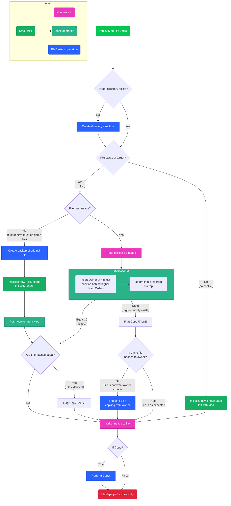
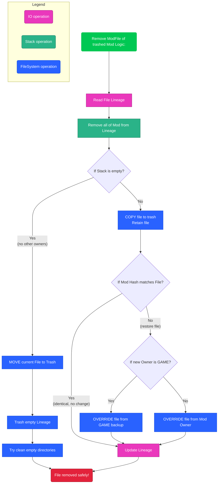

# Technical design

## Directories:
I think this shows really clearly what and where I'm storing data.

```mermaid
graph TD
    ProgramData[Program Data]
    ModStorage[Mod Storage]
    GameDir[Game Directory]

    
    subgraph ProgramData
        PD[~/.modmanager/] --> Config(config.json)
        PD --> GamesDir[games/]
        
        GamesDir --> GameList(game_list.json)
        GamesDir --> GameConfig(Game_id.json)
        GamesDir --> IconsDir[icons/]
        IconsDir --> Icon(Game_id.png)

        PD --> TempDir[.temp/]
        TempDir[.temp/] --> CompileDir(CompileMe/)
        TempDir[.temp/] --> TempTrashDir[trash/] --> TrashMod(other-unused-51449__20251226_102656/)

        PD --> LogDir[logs/]
    end

    subgraph ModStorage
        MS[./ModStorage/] --> GameMods[Game_id/]
        
        GameMods --> ModA[other-tstmod-10808/]
        
        ModA --> MAhome[.mod_manager]
        MAhome --> MAmanifest[manifests/] --> MAman(other-tstmod-10808.json)

        ModA --> MAf1(example_file_1.txt)
        ModA --> MAd1[data/] --> MAf2(example_file_2.txt)
    end

    subgraph GameDir
        GR[./GameRoot/] --> GameFiles[Vanilla game files]
        GR --> ModManagerDir[.mod_manager/]
        
        ModManagerDir --> ManifestDir[manifests/] --> MMD_Man(mod_id.json)
        ModManagerDir --> LineageDir[lineages/] --> MMD_lineage(file.txt.json)
        ModManagerDir --> BackupsDir[backups/] --> MMD_back(file.txt.backup)
        ModManagerDir --> GameState(game_state.json)
    end    

    %% Styles
        style PD color:#FFFFFF, fill:#265250, stroke:#0acdc4
            style ProgramData stroke:#0acdc4
        style MS color:#FFFFFF, fill:#693e21, stroke:#cd580a
            style ModStorage stroke:#cd580a
        style GR color:#FFFFFF, fill:#36632c, stroke:#2ccd0a
            style GameDir stroke:#2ccd0a

        %% Example data
            style GameConfig color:#FFFFFF, fill:#000f3f, stroke:#1b368d
            style Icon color:#FFFFFF, fill:#000f3f, stroke:#1b368d
            style CompileDir color:#FFFFFF, fill:#000f3f, stroke:#1b368d
            style TrashMod color:#FFFFFF, fill:#000f3f, stroke:#1b368d
            
            style ModA color:#FFFFFF, fill:#000f3f, stroke:#1b368d
            style MAman color:#FFFFFF, fill:#000f3f, stroke:#1b368d
            style MAf1 color:#FFFFFF, fill:#000f3f, stroke:#1b368d
            style MAd1 color:#FFFFFF, fill:#000f3f, stroke:#1b368d
            style MAf2 color:#FFFFFF, fill:#000f3f, stroke:#1b368d

            style MMD_Man color:#FFFFFF, fill:#000f3f, stroke:#1b368d
            style MMD_lineage color:#FFFFFF, fill:#000f3f, stroke:#1b368d
            style MMD_back color:#FFFFFF, fill:#000f3f, stroke:#1b368d
```


 Here's a general breakdown of each section:

#### GameDir
This is where the game needs mods installed. Example: in Sifu this is `./Sifu/Content/Paks/~mods/` or in most games this is the base root of the game. (its per-game configurable in my manager)
The `.mod_manager/` is where the manager will store all its "deployment" files, as it stores active deployment data in the game to ensure the game can be restored to without mods without any external files.

#### ProgramData
This is pretty self-explainable, its simply what the runtime/working directory of the program is, this includes user-generated content such as game.json profiles, game icons and temporary data. (`game_list.json` has never been implemented, I never needed it in the end but that's where I would put it.)

#### ModStorage
To use a mod with the loader, they must fist be compiled into a format the program expects. In my case all this means is that the Mod contents must be ready for deployment (copy-paste into game) and it makes a manifest to store Mod metadata and what files with paths and hashes that mod owns.


# Logic:

## Deploy a Mod
How a Mod is safely deployed to the at the logical level:
1. Fist we need to fetch/verify the ModManifest. Then in temp we make a directory to work with the mod within, called `{mod-id}__{numerical-timestamp}`

2. Then here's what I do that I think is subtle: I don't copy all the Mod files to the temp location, instead I run the checks against the game and load-order rules to decide if a file can be deployed to the game, only then it is copied to temp. 

3. By now we have a pre-built Mod that can be copied directly with overwrites to the game, that will only override what it is allowed to based on the current deployment. One simple step, since copying a directory is already tedious in Java.

4. Update the GameState.json, just add a new Mod entry. (`Mod` and `ModManifest` of different children of a `ModMetadata` class. A Mod is lighter, no file details. Used for GUI and other light processes. The ModManifest is only fully used for core Mod operations.)


Of course, this doesn't really tell you how I do it. 😇 This next diagram is how step 2 works, the `copyModFile()` method that actually has the brains. Here's my diagram for how that works:



Key takeaways:
- FileLineage is a Stack<FileVersion> that stores File versions that have (ModID, Hash and a timestamp of write) stacked in order of ownership, where the top entry is current, so by peeking I can guarantee that I get the current owner's ID.
- This also makes backups of game-files, adding the GAME as the initial fileLineage owner, so it can restore form backups when needed.

- It won't re-write files if they have the same hash, even if it's from another owner (Mod/Game) but internally it will register itself as the new owner.

- This supports re-deploying a currently deployed ModID, irrelevant of if the load order or entire file-contents have changed. If a Mod finds an entry of itself in lineage, it will remove all traces of itself first before re-installing itself.
- Part of this is if a Mod is not allowed to own a file, it will then verify the file is what the current owner expects and restore from that Mod's files if needed. This allows a Mod to be re-deployed with a lesser load order, so it was the current owner but now has relinquished ownership!


## Remove a Mod
This process is rather simple, here's just some worthy mentions:
- Every file MUST have a FileLineage, that's part of the deployment "rules".
- I run removeAll as a redundant error-prevention, on top of deploy-mod doing the same.
- A complete copy of all the files at the time the mod was removed is made in trash (also timestamped), the idea is that just like with mod deployment, that temp mod is a complete instance of every file that mod used at the time it was trashed and could be pasted directly back into the game files for a perfect restore.



Key take away:
- Mod files are never "deleted", only moved to a trash location.
- If a file has other owners, the file will be restored to what the new current owner expects.

## Batch processes
To deploy a batch, you pass a GameState, A file that contains a list of deployed Mods WITH **explicit load order values** these are what are used, not the manifest's default/preferred load order. (File Lineage does not store the owner load order, instead it MUST check the current GameState to always get the real, current value of the Mod's load order when it was deployed.)

So we have a GameState that we want the game to be set to, what I do is make a GameState Diff, comparing the request to the current GameState. The difference is the Diff instance uses additional Mod fields, stating if a Mod is enabled or disabled, whereas a GameState normally only contains enabled Mods.
This tells the batch processor to trash disabled entries and deploy enabled entries.

When a Mod is added/removed to/from a GameState it is ordered by load order, to the gameState also has a natural order, so when a GameState is deployed is also deploys in the order with the LEAST file conflicts, *eliminating* extra overhead from any file-repairs/restorations.


# Log
Logging is done carefully to avoid oversaturated information but is also richly formatted to be as functional as possible for both Power users and Developers (me)

Here is a snippet of a log file:
```log
Log file created at: Jan 31, 2026 10:35 pm
Operating system: Linux
Current configuration
	Version: 4.0.4
Manager:
	Game data dir   : mod_manager/games
	Temp dir        : mod_manager/.temp
	Trash dir       : mod_manager/.temp/trash
	logging dir     : mod_manager/logs
Game Structure:
	Manager data dir : .mod_manager
Preferences:
	TRASH_DAYS_OLD  : 20
	TRASH_SIZE_LIMIT : 50
	NORMALISE_BY_GROUP : true
	TRASH_SIZE_WARNING : 0

========================
Program started logging...
[Jan 31, 2026 10:35 pm] - [Info] : Loading GameState from: /home/hdd700/Programming/java/JarProjects/fcmm/TEST_FILE_SYSTEM/Games/test-game/.mod_manager/game_state.json
[Jan 31, 2026 10:35 pm] - [Info] : Fetching all mods...
[Jan 31, 2026 10:35 pm] - [Info] : Mods retrieved
[Jan 31, 2026 10:35 pm] - [Info] : Filteres aplied: 
	Status: All
	Name: 
	Tags: []
[Jan 31, 2026 10:35 pm] - [Info] : 	Dropped on: Additional Mod 3
[Jan 31, 2026 10:35 pm] - [Info] : Dragger Mod functi-12441-48563 to [true] : 2
[Jan 31, 2026 10:35 pm] - [Info] : Filteres aplied: 
	Status: All
	Name: 
	Tags: []
[Jan 31, 2026 10:35 pm] - [Info] : Filteres aplied: 
	Status: All
	Name: 
	Tags: []
[Jan 31, 2026 10:35 pm] - [Info] : Filteres aplied: 
	Status: All
	Name: 
	Tags: []
[Jan 31, 2026 10:35 pm] - [Info] : Normalising by group
[Jan 31, 2026 10:35 pm] - [Info] : 
🗄 Starting to deploying GameState...
[Jan 31, 2026 10:35 pm] - [Info] : 🔒 Lock granted on Directory: /home/hdd700/Programming/java/JarProjects/fcmm/TEST_FILE_SYSTEM/Games/test-game
[Jan 31, 2026 10:35 pm] - [Info] : Making GameState Diff.
[Jan 31, 2026 10:35 pm] - [Info] : Finished GameState Diff: 🗂  Game State:
	Last Modified: 2026-01-31T22:35:54.606943683
	Deployed Mods:
		⚫ ID: additi-23582-50485 | Name: Additional Mod 3                         | Order : 1    | true
		⚫ ID: functi-12441-48563 | Name: Function Test                            | Order : 1    | false

[Jan 31, 2026 10:36 pm] - [Info] : Normalising by group
[Jan 31, 2026 10:36 pm] - [Info] : 
🗄 Starting to deploying GameState...
[Jan 31, 2026 10:36 pm] - [Info] : 🔒 Lock granted on Directory: /home/hdd700/Programming/java/JarProjects/fcmm/TEST_FILE_SYSTEM/Games/test-game
[Jan 31, 2026 10:36 pm] - [Info] : Making GameState Diff.
[Jan 31, 2026 10:36 pm] - [Info] : Finished GameState Diff: 🗂  Game State:
	Last Modified: 2026-01-31T22:36:09.626793169
	Deployed Mods:
		⚫ ID: functi-12441-48563 | Name: Function Test                            | Order : 2    | true

[Jan 31, 2026 10:36 pm] - [Info] : 📦 Attempting to deploy Mod functi-12441-48563...
[Jan 31, 2026 10:36 pm] - [Info] : 🔒 Lock granted on Directory: mod_manager/.temp/functi-12441-48563__20260131_223609
[Jan 31, 2026 10:36 pm] - [Info] : Copying files to temp...
[Jan 31, 2026 10:36 pm] - [Info] : ⚪ No found File conflicts.
[Jan 31, 2026 10:36 pm] - [Info] : Creating Directories for lineage at: mod_manager/.temp/functi-12441-48563__20260131_223609/.mod_manager/lineages
[Jan 31, 2026 10:36 pm] - [Info] : Writing updated lineage at: mod_manager/.temp/functi-12441-48563__20260131_223609/.mod_manager/lineages/ic_file_text.png.json
[Jan 31, 2026 10:36 pm] - [Info] : ✔ File copied from: /home/hdd700/Programming/java/JarProjects/fcmm/TEST_FILE_SYSTEM/Mods/test-game/functi-12441-48563/ic_file_text.png to mod_manager/.temp/functi-12441-48563__20260131_223609/ic_file_text.png

[Jan 31, 2026 10:36 pm] - [Info] : ⚫ Found file conflict, resolving...
[Jan 31, 2026 10:36 pm] - [Info] : ✔ Exsisting Lineage found.
[Jan 31, 2026 10:36 pm] - [Info] : ✔ Pushed as new owner in lineage.
[Jan 31, 2026 10:36 pm] - [Info] : Creating Directories for lineage at: mod_manager/.temp/functi-12441-48563__20260131_223609/.mod_manager/lineages
[Jan 31, 2026 10:36 pm] - [Info] : Writing updated lineage at: mod_manager/.temp/functi-12441-48563__20260131_223609/.mod_manager/lineages/ic_home.png.json
[Jan 31, 2026 10:36 pm] - [Info] : ✔ File copied from: /home/hdd700/Programming/java/JarProjects/fcmm/TEST_FILE_SYSTEM/Mods/test-game/functi-12441-48563/ic_home.png to mod_manager/.temp/functi-12441-48563__20260131_223609/ic_home.png

[Jan 31, 2026 10:36 pm] - [Info] : ⚪ No found File conflicts.
[Jan 31, 2026 10:36 pm] - [Info] : Creating Directories for lineage at: mod_manager/.temp/functi-12441-48563__20260131_223609/.mod_manager/lineages
[Jan 31, 2026 10:36 pm] - [Info] : Writing updated lineage at: mod_manager/.temp/functi-12441-48563__20260131_223609/.mod_manager/lineages/ic_image_placeholder.png.json
[Jan 31, 2026 10:36 pm] - [Info] : ✔ File copied from: /home/hdd700/Programming/java/JarProjects/fcmm/TEST_FILE_SYSTEM/Mods/test-game/functi-12441-48563/ic_image_placeholder.png to mod_manager/.temp/functi-12441-48563__20260131_223609/ic_image_placeholder.png

[Jan 31, 2026 10:36 pm] - [Info] : Mod copied from temp to: /home/hdd700/Programming/java/JarProjects/fcmm/TEST_FILE_SYSTEM/Games/test-game
[Jan 31, 2026 10:36 pm] - [Info] : Cleaning temp...
[Jan 31, 2026 10:36 pm] - [Info] : 📦 Mod functi-12441-48563 successfully deployed!
[Jan 31, 2026 10:36 pm] - [Info] : Saving GameState to: /home/hdd700/Programming/java/JarProjects/fcmm/TEST_FILE_SYSTEM/Games/test-game/.mod_manager/game_state.json
[Jan 31, 2026 10:36 pm] - [Info] : 🔓 Lock released: temp:/home/hdd700/Programming/java/JarProjects/fcmm/mod_manager/.temp/functi-12441-48563__20260131_223609
[Jan 31, 2026 10:36 pm] - [Info] : 
Progress: 100% [##################################################]

[Jan 31, 2026 10:36 pm] - [Info] : 🔓 Lock released: test-game
[Jan 31, 2026 10:36 pm] - [Info] : 
🗄 Done deploying GameState.
[Jan 31, 2026 10:36 pm] - [Info] : Fetching all mods...
[Jan 31, 2026 10:36 pm] - [Info] : Mods retrieved
[Jan 31, 2026 10:36 pm] - [Info] : Filteres aplied: 
	Status: All
	Name: 
	Tags: []
[Jan 31, 2026 10:36 pm] - [Info] : Loading GameState from: /home/hdd700/Programming/java/JarProjects/fcmm/TEST_FILE_SYSTEM/Games/fallout-4/.mod_manager/game_state.json
[Jan 31, 2026 10:36 pm] - [Info] : Fetching all mods...
[Jan 31, 2026 10:36 pm] - [Info] : Mods retrieved
[Jan 31, 2026 10:36 pm] - [Info] : Filteres aplied: 
	Status: All
	Name: 
	Tags: []
```